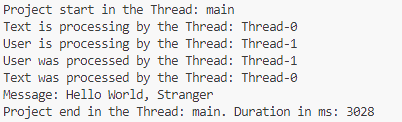

##### Goal

The goal of this project is to present how to create **concurrency** in **Java** programming language using **manually created** class **Thread** and class **ForkJoinPool**.

In this example we expect message: **Hello World, Stranger**. This message is combination of results of two separate cuncurrent threads:
* **Text Thread**: this thread is delayed for 3 seconds and returns text "Hello World"
* **User Thread**: this thread is deleyed for 1 second and returns text "Strenger"

##### Terminology

* **Java**: Java is a versatile, object-oriented, high-level programming language designed for building platform-independent applications.
* **Concurrency**: concurrency in Java refers to the ability of a program to execute multiple tasks simultaneously, improving efficiency and performance.
* **Thread class**: in Java, a thread can be created by extending the Thread class. This involves defining a class that inherits from Thread and overriding its run() method with the code you want to execute concurrently. Once an instance of this class is created, you start the thread by calling its start() method, which internally calls the overridden run() method.
* **ForkJoinPool class**: The ForkJoinPool class in Java is part of the java.util.concurrent package and is designed to support parallel execution of tasks. It uses the Fork/Join framework, which divides a large task into smaller sub-tasks (forking) and combines their results (joining).

##### Images

##### Usage

To run this project please run **main()** method in the **Main** class.