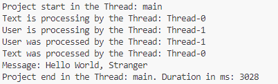

##### Goal

The goal of this project is to present how to create **concurrency** in **Java** programming language using **Future** class with interface **Callable**. Interface Callable hat to return something. Class Future is always used together with **ExecutorService** class. Class Future can be created in following ways:
* **Classic**: create new class which implements interface Runnable
* **Abstract Method**: create interface Runnable directly without new class
* **Lambda**: implement interface Runnable as Lamda

In this example we expect message: **Hello World, Stranger**. This message is combination of results of two separate cuncurrent threads:
* **Text Thread**: this thread is delayed for 3 seconds and returns text "Hello World"
* **User Thread**: this thread is deleyed for 1 second and returns text "Strenger"

##### Terminology

* **Java**: Java is a versatile, object-oriented, high-level programming language designed for building platform-independent applications.
* **Concurrency**: concurrency in Java refers to the ability of a program to execute multiple tasks simultaneously, improving efficiency and performance.
* **Future class**: in Java, the Future class (part of the java.util.concurrent package) represents the result of an asynchronous computation. It provides methods to check if the computation is complete, wait for its completion, and retrieve the result of the computation once it is done.
* **Callable interface**: in Java, the Callable interface is part of the java.util.concurrent package and represents a task that can return a result and may throw a checked exception. It is similar to the Runnable interface but is more flexible because it can return a value and propagate exceptions.
* **ExecutorService class**: ExecutorService is a part of Java's concurrency framework in the java.util.concurrent package. It provides a higher-level API for managing and controlling thread execution compared to manually creating and managing threads.

##### Images

##### Usage

To run this project please run **main()** method in the **Main** class.