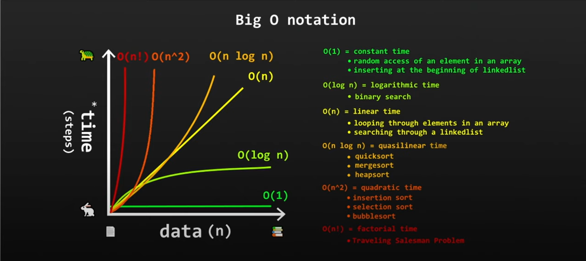

## Goal

Goal of this project is to create application which will find index of the element in the array using **Linear Search**. This is the simplest method of searching. It checks each element one by one until it finds the target element or reaches the end of the array.

Linear Search info:
* Good for small and medium data
* Result provided in 0(n) time

##### Hints
Hints:
* Iterate over all elements in the array

##### Complexity

