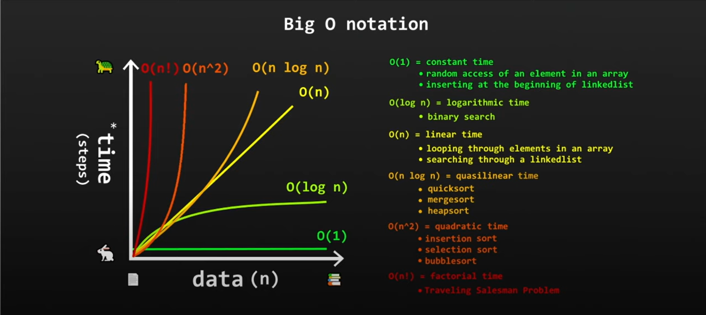

## Goal

Goal of this project is to present how to sort array using **Merge Sort** alghoritm. Merge Sort is a divide-and-conquer algorithm that divides the array into smaller sub-arrays, sorts them, and then merges them back together.

Info:
* Acceptable huge amount of data
* Result provided in 0(n log n) time
* But it uses more space then Bubble Sort

##### Hints
Hints:
* Use variables lenght, i, r, l
* Use while loop in both methods to fill with data
* Use mergeSort(array) to divide array in leftArray and rightArray
* Use merge(arrayLeft, arrayRight) to merge arrays

##### Complexity

